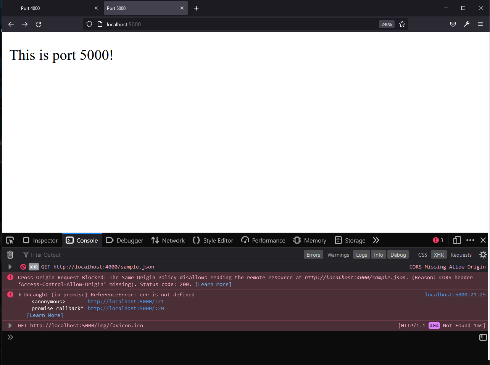
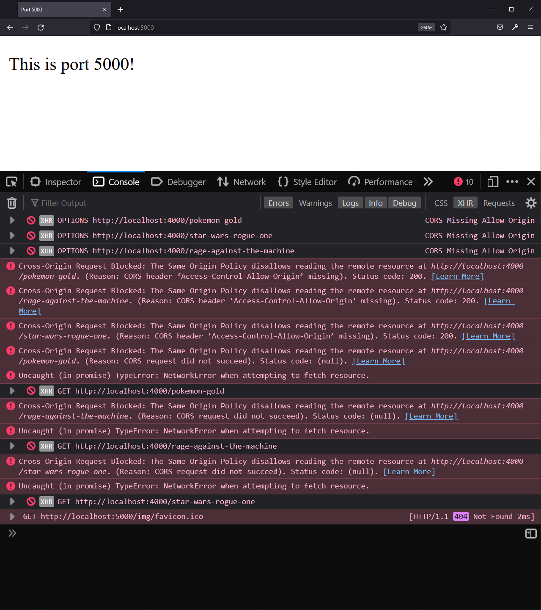

Joshua Murphy

CS 595 - Web Security

Assignment 5

 

## Assignment Description 5.1 - CORS: Blocking and reading responses from another origin 

For this part, I have created two local servers, each assigned to separate port numbers, 4000 and 5000 respectively. 
The server on port 4000 has an JSON file, called sample.JSON, and sends that JSON as a response to an html page, that being
homepage and homepage_5000, with homepage being on the same origin server as the JSON file. The following code is 
for controlling both servers. Without setting the Access-Control-Allow-Origin, as done between lines 9-15, then
the server will block responses from other servers, even if they are running on the
same machine, with the following message in the console log being "Cross-Origin Request Blocked: The Same Origin Policy disallows reading the remote resource at http://localhost:4000/sample.JSON. (Reason: CORS header ‘Access-Control-Allow-Origin’ missing). Status code: 200.". 

    const express = require('express')
    const port1 = '4000'
    const port2 = '5000'
    const app1 = express()
    const app2 = express()

    //Cross-Origin Request Allowance
    //comment out lines 9 - 15 to block CORS requests
    
    var allowCrossDomain = function(req, res, next) {
        res.header('Access-Control-Allow-Origin', "http://localhost:5000")
        res.header('Access-Control-Allow-Methods', 'GET,PUT,POST,DELETE')
        res.header('Access-Control-Allow-Headers', 'Content-Type')
        next()
    }
    app1.use(allowCrossDomain)
    
    //Static Files
    app1.use(express.static('api'))

    //Set Views
    app1.set('views', './views')
    app1.set('view engine', 'ejs')

    app2.set('views', './views')
    app2.set('view engine', 'ejs')

    //Get pages
    app1.get('/', (req, res) => {
        res.render('homepage')
    })

    app1.get('/sample.JSON', (req, res) => {
        res.JSON('sample')
    })

    app2.get('/', (req, res) => {
        res.render('homepage_5000')
    })

    //Listening for specified host and port
    app1.listen(port1)
    app2.listen(port2)

As stated, lines 9-15 allow for responses from another origin, in this case
I'm allowing for localhost:4000 to post responses to localhost:5000. If it is 
successful, it will print the contents of the JSON to the web page, as well as
send a GET response that can be viewed using the web developer tool. If lines
9-15 are commented out, then Cross-Origin Resource Sharing (CORS) will be disabled,
and an error message will be displayed to the console explaining that CORS is not 
allowed.

 

Both HTML pages use the following fetch code to fetch the JSON file and return it
to the server.

    fetch("http://localhost:4000/sample.JSON")
        .then(function(response){
                return response.JSON()
            })
            .then(function (data) {
                appendData(data)
            })
            .catch(function(data){
                console.log('error: ' + err)
                document.write(err)
            })
            function appendData(data) {
            var mainContainer = document.getElementById("myData")
            for (var i = 0; i < data.length; i++) {
                var div = document.createElement("div")
                div.innerHTML = data[i].Band + ' ' + data[i].Game + ' ' + data[i].Movie
                mainContainer.appendChild(div)
                }
            }
 

Images:

CORS Blocked

CORS Allowed

 

## Assignment Description 5.2 - CORS: Blocking and reading HTTP response headers from another origin

For the second part of this assignment, I will demonstrate how and why an http 
response is blocked from one server to the other that are not sharing the same
origin. Port 5000 tries to fetch the three different pages I created for my 
favorite things, which are stored on and accessed on port 4000, however like part 1, if CORS is not properly set to allow 
responses from other origins, then it will be blocked. The code used in server.js
is similar to the first part, with the differences being that I added the allowance
of headers of Origin and X-Requested-With. If CORS is allowed then the page will 
display the header responses for each page.

HTML fetch:

    //CORS request from localhost:4000
    fetch("http://localhost:4000/pokemon-gold")
        .then(response=>{
            paragraph = document.getElementById("p")
            for(const header of response.headers){
                console.log(`Name: ${header[0]}, Value:${header[1]}`);
                document.write(`Name: ${header[0]}, Value:${header[1]}`)
                //paragraph.appendChild(`Name: ${header[0]}, Value:${header[1]}`)
            }
            
            document.write(" ")
        });
    document.write("\n")
    fetch("http://localhost:4000/star-wars-rogue-one")
        .then(response=>{
            paragraph = document.getElementById("p")
            for(const header of response.headers){
                console.log(`Name: ${header[0]}, Value:${header[1]}`);
                document.write(`Name: ${header[0]}, Value:${header[1]}`)
                //paragraph.appendChild(`Name: ${header[0]}, Value:${header[1]}`)
            }
            
            document.write(" ")
        });
    fetch("http://localhost:4000/rage-against-the-machine")
        .then(response=>{
            paragraph = document.getElementById("p")
            for(const header of response.headers){
                console.log(`Name: ${header[0]}, Value:${header[1]}`);
                document.write(`Name: ${header[0]}, Value:${header[1]}`)
                //paragraph.appendChild(`Name: ${header[0]}, Value:${header[1]}`)
            }
            
            document.write(" ")
    });

Images:

HTTP response blocked

HTTP response allowed

 

## Assignment Description 5.3 - Content-Security-Policy: embedding from another site

The final part for this assignment will show how even if an external site allows for 
it to be embedded in an iframe, that CORS can still block that page from being embedded 
on your server with the following code.

    var allowCrossDomain = function(req, res, next) {
        res.header('Access-Control-Allow-Origin', "https://www.bandcamp.com/")
        res.header('Access-Control-Allow-Methods', 'GET,PUT,POST,DELETE')
        res.header('Access-Control-Allow-Headers', 'Content-Type')
        
        res.set("Content-Security-Policy", "default-src 'self'")
        res.render('CSP_self_only')
        
        next()
    }
    app1.use(allowCrossDomain)

With the Content-Security-Policy being set to 'self', the server will only render
an iframe if it is of the same origin. This is helpful when trying to prevent
cross-site-scripting (XSS) attacks. To allow for iframes outside of the origin, 
comment out the lines set and render lines dealing with the Content-Security-Policy.
I also created a page 'CSP_self_only.ejs' that will render to the user the error 
messages that display to the console when the Content-Security-Policy is set to 'self'.

Images:

No CSP set

CSP set to self

 

## Video Links

Playlist - https://youtube.com/playlist?list=PLQ_PLRjJduEhYEG00BqCF4hvRS4RVyVhD

Part 1 - https://youtu.be/Hn-1zs1YbUM

Part 2 - https://youtu.be/MweQISn_f-E

Part 3 - https://youtu.be/taOKhE0_Vc4

 

## References

1.) Enabling CORS - https://stackoverflow.com/questions/18642828/origin-origin-is-not-allowed-by-access-control-allow-origin

2.) Fetching JSON files - https://howtocreateapps.com/fetch-and-display-JSON-html-javascript/

3.) Assignment 5 - https://github.com/phonedude/cs595-s22/blob/main/assignments/assignment-5.md

4.) Content-Security-Policy - https://content-security-policy.com/