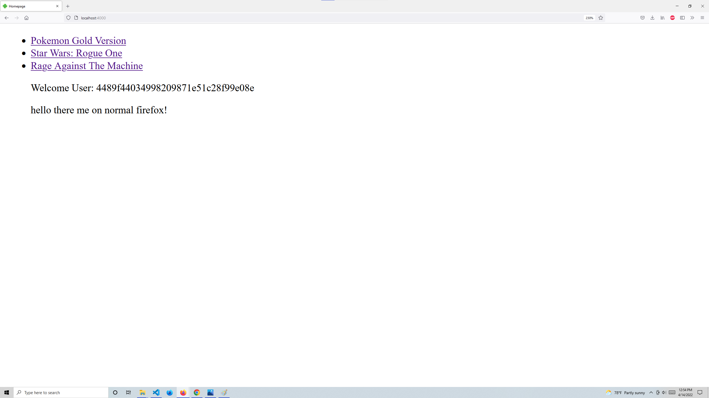
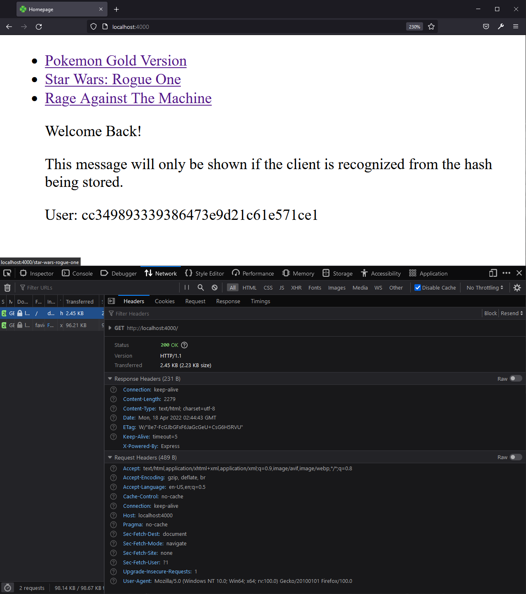

Joshua Murphy

CS 595 - Web Security

Assignment 6

 

# Fingerprinting Machines based on Header Requests to a Server

## Server Side Code

For this assignment, I had to write sever side code that would create a 
fingerprint of the user's browser when visiting the server, by taking 
three request headers and creating a hash, using md5, and is able to 
recognize different machines and browsers based on said hash value.
This program requires the packages express, fs, and md5.

Due to the server.js file having over 100 lines of code, I will separate 
the key functions and lines of code used to fingerprint the user, and describe 
them. 

The first function checks if the csv file we use to store the hash values in 
already exists or not. If it doesn't, it will create it.

    function checkForFile(path){
    if (!fs.existsSync(csv))
        fs.writeFileSync(path, 'hash', json)

For the fingerPrinting() function, it takes 3 parameters, which are the three
request headers used to create the hash used for the fingerprint. It adds the 
three parameters together, preforms a hashing function on them, and then returns the
hash value.

    function fingerPrinting(data_1, data_2, data_3){
        data_final = data_1 + data_2 + data_3
        data_hash = md5(data_final)
        return(data_hash)
    }

Next, the printLog() function takes four parameters, the 3 headers used to create
the hash, and the hash itself. It then prints the parameters to the console log 
of the server.

    function printLog(data_1, data_2, data_3, data_4){
        console.log('User-Agent: ' + data_1)
        console.log('Accept: ' + data_2)
        console.log('Accept-Language: ' + data_3)
        console.log('Hash: ' + data_4 + '\n')
    }

I also store the hash value into a csv file so that the server can check 
if the client is new or returning. It takes in 3 parameters, the hash value, 
the path of the file, and an array of hash values. If the hash value is not 
already stored in the file, it will write it. Otherwise, if the hash is already
in the file, it will ignore it.

    var storeData = (data_1, path, array) => {
        try {
            // Store data parameters into string variable
            var hash = JSON.stringify(data_1) 
            // Remove double quotes and backslash added in writing process
            var res = hash
                res = res.toString()
                res = res.replace(/\\/g, '')
                res = res.replaceAll('""', '"')
                res = res.replaceAll('"', '')

            if (!array.includes(data_1)) {
                fs.appendFile(path, '\n' + (res), function(err){
                    if (err) throw err
                })
            }  
        } catch(err) {
            console.error(err)
        }
    }

Finally, there is the readData() function that reads the file into a variable, 
and then returns it.

    function readData(){
        var data = fs.readFileSync('test.csv', 'utf8').toString().split("\n")
        return(data)
    }

Finally, when getting the homepage of the server, we use the functions 
discussed above along with getting the request headers that we will pass
into said functions. First, fingerPrinting() is called to store 
the resulting hash into the variable data_hash. Then, printLog() is called 
passing in the three aforementioned headers and the hash, which prints 
to the console the results. The page is then rendered to the user, passing the hash and hashArray values to the HTML
for later use. Finally, storeData() is used to write the hash value to the csv file if is not already 
in the file.

    app1.get('/', (req, res) => {
        var ua = JSON.stringify(req.headers['user-agent'])
        var ac = JSON.stringify(req.headers['accept'])
        var al = JSON.stringify(req.headers['accept-language'])
        
        data_hash = fingerPrinting(ua, ac, al)

        printLog(ua, ac, al, data_hash)

        checkForFile(csv)
        hashArray = readData()
        console.log(hashArray)

        var hash = data_hash
        res.render('homepage', {data: {hash:hash, hashArray:hashArray}})
        storeData(data_hash, csv, hashArray)
    })

 

## HTML side code

In the EJS file for the homepage of the server, a script is used to check if the hash is included in the 
array hashArray. If it is not in the array, the client is new to the server 
and the message "Welcome New User: %hash" is appended to the homepage. 
If the hash value is in the array, it will instead append the message 
"Welcome Back! This message will only be shown if the client is recognized 
from the hash being stored.", with the hash value also included.

    <!doctype html>
    <html lang='en'>
        <head>
            <meta charset='utf-8' />
            <title>Homepage</title>
            <link rel="icon" type="image/x-icon" href="/img/favicon.ico">
        </head>
        <body>
            <ul>
            <li><a href="/pokemon-gold">Pokemon Gold Version</a></li>
            <li><a href="/star-wars-rogue-one">Star Wars: Rogue One</a></li>
            <li><a href="/rage-against-the-machine">Rage Against The Machine</a></li>
            
            

            
        </ul>
        </body>
    </html>

## Table 

| Operating System | Browser | User-Agent OS | Hash Value |
|-|-|-|-|
|Windows 10 OS |FireFox Web Dev version 100.0 |Windows NT 10.0; Win64; x64 | cc349893339386473e9d21c61e571ce1
|Windows 10 OS |Firefox version 99.0 |Windows NT 10.0; Win64; x64 | 4489f44034998209871e51c28f99e08e
|Windows 10 OS |Chrome version 100.0.4896.88 |Windows NT 10.0; Win64; x64 | 1b5cbe0a423bfbcf0a97a981056736b5
|Windows 10 OS |Microsoft Edge version 100.0.1185.39 |Windows NT 10.0; Win64; x64 | d5c25e575e32b870b40c56af0ac71892
|iPhone iOS 15 |Safari version 604.1 |iPhone; CPU iPhone OS 15_3_1 like Mac OS X | 849a1aeefae18d7d13bc841684492bcd
|iPhone iOS 15 |Brave version 1.37 |iPhone; CPU iPhone OS 15_0 like Mac OS X | 053d0f690dac9a651c6e29a9c32b34e4
|iPad iOS 12 |Safari version 604.1 |iPad; CPU OS 12_5_5 like Mac OS X | 6c248adf1179d2ee8019e72469eb9089
|iPad Pro iOS 15 |Safari version 605.1.15 |Macintosh; Intel Mac OS X 10 | 43c1f22506606872923d4edabba55671
|Windows 11 OS |Firefox version 99.0 |Windows NT 10.0; Win64; x64 | 4489f44034998209871e51c28f99e08e
|Windows 11 OS |Microsoft Edge version 100.0.1185.39 |Windows NT 10.0; Win64; x64 | d5c25e575e32b870b40c56af0ac71892

For this table, any devices that repeat under the 'Operating System' column are the same device. 
2 Desktop computers, 1 iPhone, and 2 iPads were used in the collection of this data, with with 6 different browses used,
though the Safari browser on the iPad Pro was running a more up to date version than the 2 other Apple devices.
There are a few interesting pieces of information that can be seen from this table. To stat with, even though Windows 10
and Windows 11 are technically different operating systems, the user-agent sees them as both being Windows NT 10.0, which 
is a proprietary graphical operating system. Because of this, even though they are two separate machines, because they are 
identical as far as the user-agent is concerned, the hash values are the same, and thus are seen as the same user. This 
is why I believe that when taking a users fingerprint, other things are used besides just request header information, for example
the GPU running in the machine, often times collected by generating a graphical image or drawing a picture, as well as
screen resolution, among other factors to narrow down the unique differences of a user's machine. Another interesting 
piece of information is the fact that the first iPad was seen as an iPad running iOS 12, but the 2nd iPad, and iPad Pro, was
seen as a Macintosh running Mac OS X 10. I'm not entirely sure why this is, (the iPads are not mine), but from around 
iOS version 13, iPad Pros are seen as being Macs running OS X. Finally, for giggles I decided to run the server on my
iPhone using the Brave browser, and even though it is running Safari on the back-end, due to being an iPhone, it is 
still able to recognize it as running Brave on the front-end.

## Images of the Server Running on Multiple Devices and Browsers.

Below are five screenshots taken from a few of the devices and browsers 
tested above.

Windows 10 OS running FireFox 99.0

 

Windows 10 OS running FireFox Web Dev 100.0

 

Windows 11 OS running FireFox 99.0

 

iPhone iOS 15 running Safari 604.1
 

 

iPhone iOS 15 running Brave 1.37
 

 

iPad Pro iOS 15 running Safari 605.1.15
 

 

### Images of if a client is recognized

New Client

 

Returning Client

 

## Video Links

OLD: https://youtu.be/KsxcUYETObI

 

# References

1.) Assignment 6 - https://github.com/phonedude/cs595-s22/blob/main/assignments/assignment-6.md